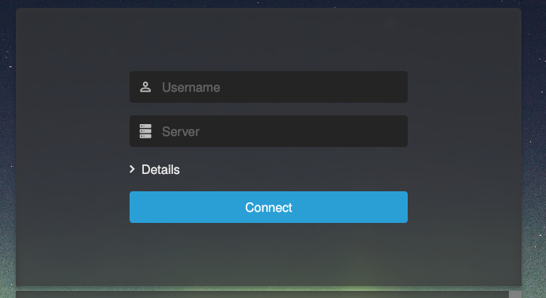
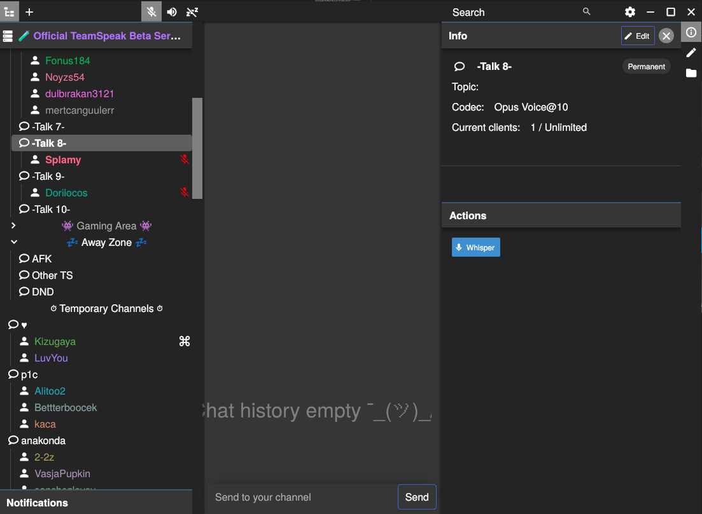
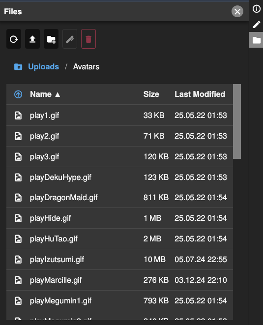
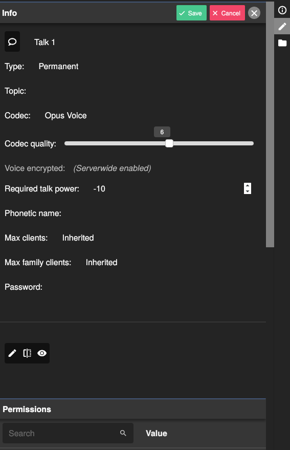

# Qint
Qint is a modern open-source alternative client for [TeamSpeak](https://teamspeak.com) servers that allows you to chat and speak with other people over the internet.

## Warning 🚨

This tool/repository is provided as-is without any support or active development.  
We are currently not open for Issues/Feature-Requests/Pull-Requests.

## Screenshots
### Login

### Main


### Filebrowser

### Channeleditor


## Dependencies
- [Rust](https://rust-lang.org), preferred installation method is [rustup](https://rustup.rs)
- [OpenSSL](https://www.openssl.org) 1.1, on Linux only
- [libopus](https://opus-codec.org), on Linux only

### Ubuntu
```bash
apt install libopus-dev libasound2-dev libwebkit2gtk-4.0-dev libappindicator3-dev
```

## Build and run Qint

### Run with QintWeb variant

QintWeb is a variant of Qint that runs as a web application, without the Tauri desktop application. It can be used for development or as a standalone web app.

```bash
cd webapp
RUST_LOG=info cargo run
# For release builds
cargo build --release
```

By default, the proxy searches for the frontend in `../frontend/build`, where the frontend gets
built by default. For packaging, it is useful to load the frontend for another directory, which can
be set during compilation: `FRONTEND_PATH=./frontend/ cargo build`

### Build the frontend
Make sure to build the backend once before building the frontend, because the backend build
autogenerates the `book_events.ts` file of the frontend.

```bash
cd frontend
# Install dependencies
bun

# For the development server
bun run dev
# For builds
bun run build
```

### Nix

```bash
nix run .#webapp
```

### Android

To build for android:
```bash
cargo tauri android build
```

### Run with Tauri

The Tauri desktop application is the main way to use Qint, it provides a native desktop experience and access to system features.

### Nix

```bash
nix run .#qint
```

### Other 

Build the frontend first, then run `cargo tauri dev` in the `src-tauri` folder.

## Install

### Nix

```nix
{
  inputs = {
    # ...
    qint = {
      url = "github:ReSpeak/Qint";
      inputs.nixpkgs.follows = "nixpkgs";
    };
  };

  outputs = {
    qint,
    ...
  } @ inputs: {
    nixosConfigurations = {
      system = nixpkgs.lib.nixosSystem {
        modules = [
          # ...
          qint.nixosModules.default
        ];
      };
    };
  };
}

```

## Dev

### Backend Logging

To activate more logging for qint and see sent commands or packets, use
`RUST_LOG=tsproto=debug,ts_bookkeeping=debug,tsclientlib=debug,qint_proxy=debug,webapp=debug,warn cargo run -- -v`.

### Frontend Logging

By default, only errors are logged.
To change that, run one of the following in the browser console:
```js
// Log everything
debug.enable("*")
debug.enable("CHAT,BINPUT")
debug.enable("*,-LL") // Everything but the lazy list
debug.enable("error:*")

// debug.enable is saved in local storage
localStorage.debug = "*"
```

## Settings

### Configure Shortcuts

On Windows in `%appdata%\ReSpeak\config.toml`:
```toml
[[shortcuts.actions]]
keycode = "F13"
action = { InputMute = "Toggle" }

[[shortcuts.actions]]
keycode = "F12"
action = { OutputMute = "True" }

[[shortcuts.actions]]
keycode = "F11"
action = { Away = "False" }
```

On Linux/X11, global shortcuts are not implemented, using the same way as wayland below is possible.
For Linux/Wayland, configure your compositor to write to the socket or make http requests (http
requests do not work when running tauri), e.g. with the following commands:
```bash
# For the unix socket
echo '{"InputMute":null}' | nc -UN /tmp/qint-hotkeys

# For web requests
curl -H "Content-Type: application/json" -X POST -d '{"InputMute":null}' http://localhost:4422/shortcut
curl -H "Content-Type: application/json" -X POST -d '{"Away":null}' http://localhost:4422/shortcut
```

## License
Licensed under the [Open Software License](LICENSE-OSL) and [GNU Affero General Public License v3](LICENSE-AGPL).
